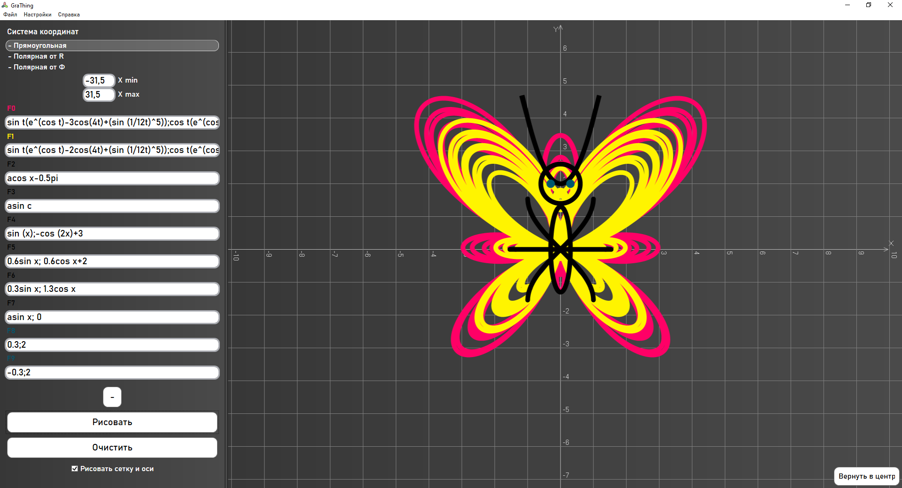
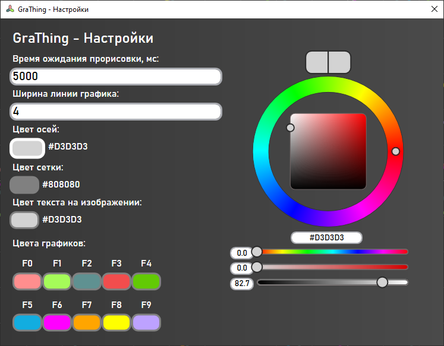
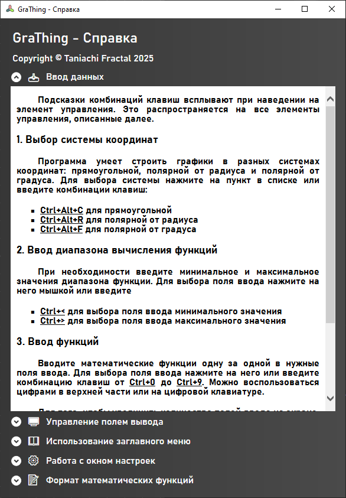

[-> The English version](README.md)

# GraThing

GraThing — это простой графический калькулятор для Windows, доступный на английском и русском языках!

## Описание

GraThing позволяет строить двухмерные графики в прямоугольной и полярной системах координат. Он также поддерживает параметрическую записб. Вы можете настраивать цвета и ширину графиков в настройках, загружать строки функций, сохранять их в файл, сохранять графики как изображения и экспортировать/импортировать настройки для дальнейшего использования. Чтобы узнать больше, прочитайте справку в приложении.

### Системные требования

* Windows 10 1709+ с установленным .NET Framework 4.8
* 2 Гб ОЗУ
* 128 Мб видеопамяти
* 20 Мб свободного места на диске

### Установка

* Загрузите последний архив со [страницы выпусков](https://github.com/TaniachiFractal/GraThing/releases)
* Создайте новую папку "GraThing" в главном каталоге пользователя и распакуйте архив туда
* Создайте ярлык для файла GraThing.exe на рабочем столе и назовите его "GraThing"

### Выполнение программы

* Дважды щелкните по ярлыку, который вы только что создали
* Может появиться сообщение об ошибке, в котором говорится, что файл настроек не найден. Это означает, что это первый запуск или файл был удален. Нажмите OK
* Все в порядке, наслаждайтесь GraThing!

## Готовые функции

Попробуйте ввести функции из [папки FuncsToTry](/FuncsToTry)! Загрузите парочку .TXT файлов и .JSON настроек в GraThing, чтобы посмотреть, что он умеет делать. 

## Обратная связь

Для обратной связи свяжитесь со мной в [@taniachifractal.bsky.social](https://bsky.app/profile/taniachifractal.bsky.social)

## Авторы

Создано Taniachi Fractal

## Лицензия

Кратко, вы можете свободно использовать выходные данные GraThing, но сам GraThing продавать нельзя. Подробности см. в файле [LICENSE.txt](LICENSE.txt)
