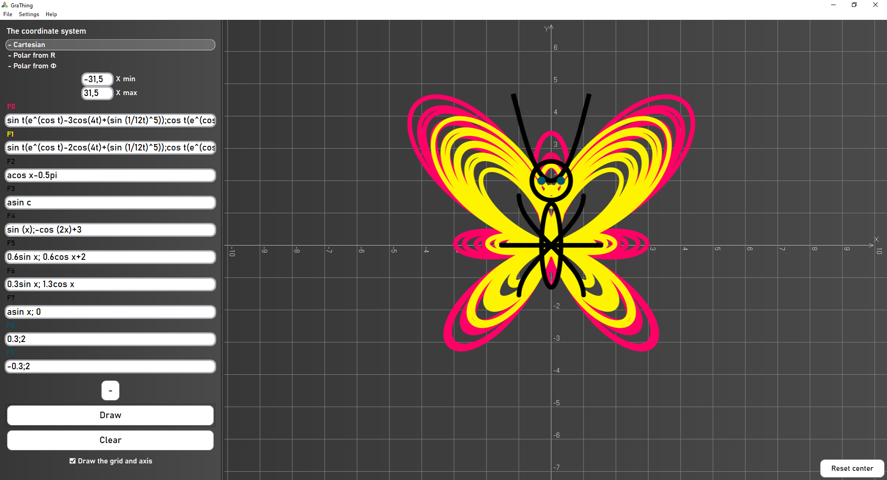
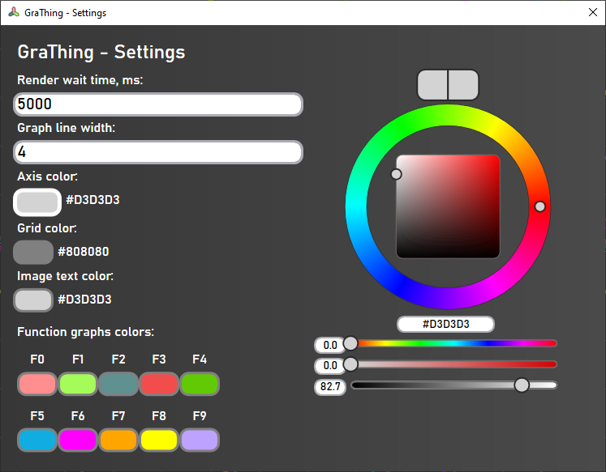
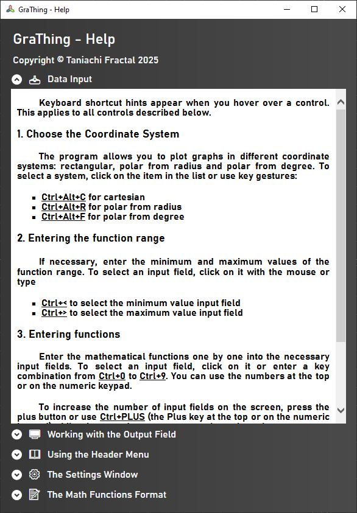

[-> Версия на русском](README-RU.md)

# GraThing

GraThing is a simple Windows Desktop graphing calculator available in English and in Russian!

## Description

GraThing allows you to plot 2D graphs in cartesian and polar coordinate systems. It also supports parametric notation. You can adjust the colors and width of graphs in the settings, load function strings, save them to file, save graphs as an image and export/import the settings for later use. Check out the Help in the app for more information.

### System requirements

* Windows 10 1709+ that has .NET Framework 4.8 installed
* 2 Gb RAM
* 128 Mb Graphics memory
* 20 Mb free disk space

### Installing

* Download the latest archive from the [Releases page](https://github.com/TaniachiFractal/GraThing/releases)
* Create a new GraThing folder in the main user directory and unpack the archive there
* Create a shortcut to the GraThing.exe file to your desktop and name it "GraThing"

### Executing program

* Double-click the shortcut you've just created
* You might see an error saying that the user preference file is not found. It means this is the first boot or the file has been removed. Click OK
* Everything's alright, enjoy the GraThing!

## Try it out!

Try inputing the functions from the [FuncsToTry folder](/FuncsToTry)! Load some .TXT files and some .JSON settings into the GraThing to see what it can do. 

## Feedback

For feedback, contact me at [@taniachifractal.bsky.social](https://bsky.app/profile/taniachifractal.bsky.social)

## Authors

Made by Taniachi Fractal

## License

Basically, you are free to use the output of GraThing, but you cannot sell the GraThing itself. See the [LICENSE.txt](LICENSE.txt) file for details
